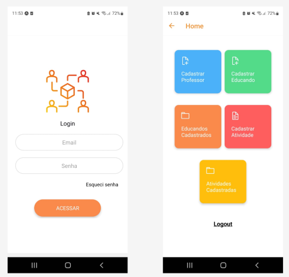
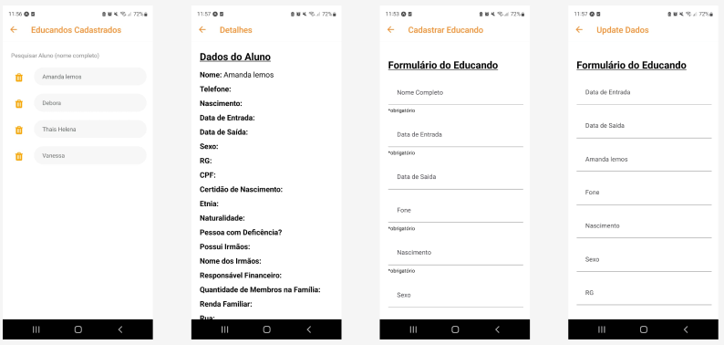
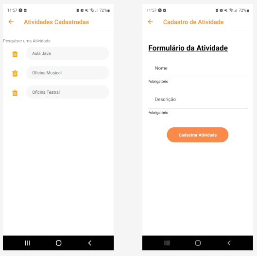
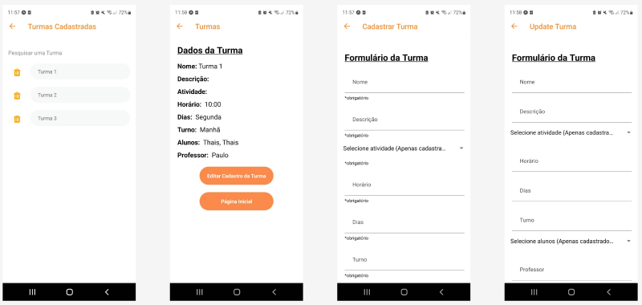

# Projeto de Interface

Pré-requisitos: <a href="2-Especificação do Projeto.md"> Documentação de Especificação</a>

Visão geral da interação do usuário pelas telas do sistema e protótipo interativo das telas com as funcionalidades que fazem parte do sistema (wireframes).

 Apresente as principais interfaces da plataforma. Discuta como ela foi elaborada de forma a atender os requisitos funcionais, não funcionais e histórias de usuário abordados nas <a href="2-Especificação do Projeto.md"> Documentação de Especificação</a>.

## Diagrama de Fluxo

O diagrama apresenta o estudo do fluxo de interação do usuário com o sistema interativo e  muitas vezes sem a necessidade do desenho do design das telas da interface. Isso permite que o design das interações seja bem planejado e gere impacto na qualidade no design do wireframe interativo que será desenvolvido logo em seguida.
 

## Wireframes

## Interfaces

As telas iniciais da aplicação correspondem à tela de login, onde o usuário irá fazer sua autenticação no sistema, e à tela home, responsável para sinalizar ao usuário a navegação e as funcionalidades do sistema.

As telas relacionandas à listagem de alunos, aos detalhes de um aluno específico e ao formulário de cadastro do mesmo. Essas telas são importantes para o administrador ter o controle total dos alunos no sistema, podendo listar, cadastrar, vizualizar e deletar os mesmos.

As telas relacionandas à listagem de atividades e ao formulário de cadastro da mesma. Essas telas são importantes para o administrador ter o controle das atividades no sistema, podendo listar, cadastrar e deletar as mesmas.

As telas relacionadas ao cadastro do professor e a página inicial que é importante para que o professor tenha o controle das turmas ao qual ele está inserido, e principalmente para ter a informação com maior facilidade de quais alunos estão cadastrados em certa turma.

As telas relacionadas à listagem das turmas, aos detalhes de uma turma específica e ao formulário de cadastro da mesma. Essas telas são importantes para que o professor tenha o controle total das turmas no sistema, podendo listar, cadastrar, vizualizar e deletar as mesmas.

